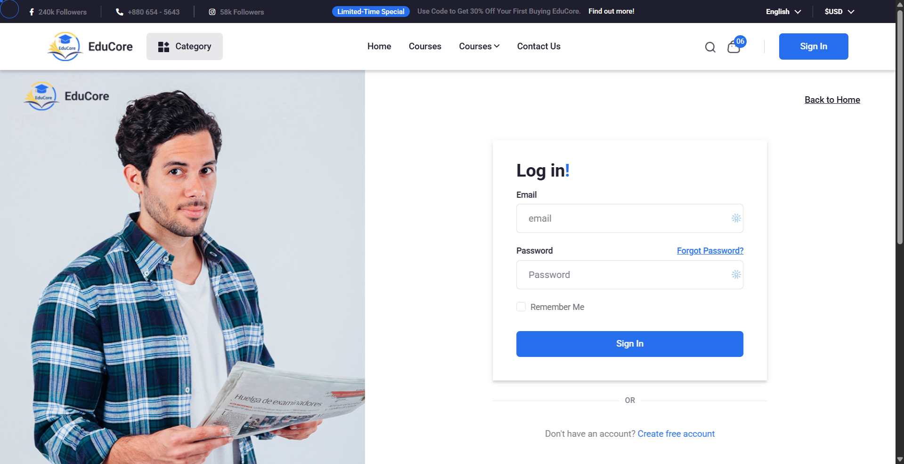

# LMS Platform - Learning Management System

<p align="center">
    
</p>

<p align="center">
<a href="https://github.com/bagalsoham/lms-platform"></a>
<a href="https://github.com/bagalsoham/lms-platform"></a>
<a href="https://github.com/bagalsoham/lms-platform"></a>
<a href="https://github.com/bagalsoham/lms-platform"></a>
</p>

<p align="center">
    <strong>Developed by <a href="https://github.com/bagalsoham">Soham Bagal</a></strong><br>
    <a href="https://www.linkedin.com/in/soham-bagal-4343bb284/">🔗 LinkedIn</a> • 
    <a href="https://github.com/bagalsoham">🔗 GitHub</a> • 
    <a href="mailto:bagalsoham1717@gmail.com">📧 Email</a>
</p>

---

## About LMS Platform

LMS Platform is a comprehensive Learning Management System built with Laravel, designed to provide a seamless educational experience for administrators, instructors, and students. This platform bridges the gap between educators and learners by offering powerful tools for course creation, content delivery, and educational management.

**Project developed by Soham Bagal as a full-stack Laravel application demonstrating advanced web development skills and real-world business logic implementation.**

## 📸 Screenshots

### 🎓 Student Experience

#### Student Dashboard & Authentication
<p align="center">
    
    <br><em>Clean and secure student authentication interface</em>
</p>

<p align="center">
    
    <br><em>Comprehensive student dashboard with course overview</em>
</p>

#### Course Discovery & Enrollment
<p align="center">
    
    <br><em>Browse and discover courses with detailed information</em>
</p>

<p align="center">
    
    <br><em>Student's enrolled courses with progress tracking</em>
</p>

#### Payment & Checkout Process
<p align="center">
    
    <br><em>Streamlined checkout process for course purchases</em>
</p>

<p align="center">
    
    <br><em>Secure payment processing interface</em>
</p>

#### Multiple Payment Gateways
<p align="center">
    
    <br><em>Multiple payment gateway options for user convenience</em>
</p>

<p align="center">
    
    <br><em>Stripe payment integration</em>
</p>

<p align="center">
    
    <br><em>Razorpay payment gateway integration</em>
</p>

<p align="center">
    
    <br><em>Payment confirmation and success page</em>
</p>

#### Profile Management
<p align="center">
    
    <br><em>Easy-to-use profile management for students</em>
</p>

### 👨‍🏫 Instructor Features

#### Course Creation & Management
<p align="center">
    
    <br><em>Comprehensive course creation interface for instructors</em>
</p>

<p align="center">
    
    <br><em>Instructor dashboard for managing created courses</em>
</p>

#### Sales & Revenue Tracking
<p align="center">
    
    <br><em>Track course sales and student enrollments</em>
</p>

### 🛠️ Admin Panel

#### Instructor Management
<p align="center">
    
    <br><em>Admin panel for managing instructor applications</em>
</p>

#### Course Approval System
<p align="center">
    
    <br><em>Course approval and moderation system</em>
</p>

#### Payment Gateway Configuration
<p align="center">
    
    <br><em>Admin configuration for payment gateways and commission settings</em>
</p>

## Key Features

- **Multi-Role Architecture**: Complete role-based access control for Admins, Instructors, and Students
- **Flexible Course Creation**: Support for video courses, text-based content, and live Zoom sessions
- **Commission System**: Automated instructor earnings with customizable commission rates
- **Secure Payment Processing**: Integrated payout management with multiple payment methods
- **Lifetime Access**: Students enjoy permanent access to purchased courses
- **Clean Learning Environment**: Distraction-free video and content player
- **Comprehensive Dashboard**: Detailed analytics and management tools for all user types
- **Profile Management**: Easy-to-use profile customization for all users

## User Roles & Capabilities

### 🛠️ Administrator
- **Platform Control**: Complete oversight of all platform operations
- **User Management**: Approve instructor applications and manage user roles
- **Financial Management**: Set commission rates and oversee payout processing
- **Content Moderation**: Review and approve course content
- **Site Configuration**: Manage platform settings and configurations

### 👨‍🏫 Instructor
- **Course Creation**: Develop and publish video, text, or live courses
- **Sales Dashboard**: Track earnings, student enrollment, and course performance
- **Content Management**: Upload materials, create announcements, and manage course structure
- **Payout Management**: Configure payment methods and request withdrawals
- **Student Interaction**: Communicate with enrolled students and provide support

### 🎓 Student
- **Course Access**: Purchase and access courses with lifetime availability
- **Learning Tools**: Use our distraction-free player for optimal learning experience
- **Progress Tracking**: Monitor learning progress and course completion
- **Profile Management**: Customize personal learning profile
- **Instructor Application**: Apply to become an instructor when ready

## 🛠️ Technology Stack

- **Backend**: Laravel 10+ (PHP 8.1+)
- **Frontend**: Blade Templates with Alpine.js, Tailwind CSS
- **Database**: MySQL/PostgreSQL
- **Authentication**: Laravel Sanctum
- **Payment**: Stripe, PayPal API Integration
- **Video**: Zoom API for live sessions
- **Storage**: AWS S3, Local Storage Support
- **Testing**: PHPUnit, Feature & Unit Tests

## 🚀 Installation

1. **Clone the repository**
   ```bash
   git clone https://github.com/bagalsoham/lms-platform.git
   cd lms-platform
   ```

2. **Install dependencies**
   ```bash
   composer install
   npm install && npm run build
   ```

3. **Environment setup**
   ```bash
   cp .env.example .env
   php artisan key:generate
   ```

4. **Database configuration**
   ```bash
   # Configure your database in .env file
   php artisan migrate
   php artisan db:seed
   ```

5. **Storage setup**
   ```bash
   php artisan storage:link
   ```

6. **Start development server**
   ```bash
   php artisan serve
   ```

## ⚙️ Configuration

### Payment Gateways
Configure your preferred payment methods in the `.env` file:
```env
STRIPE_KEY=your_stripe_key
STRIPE_SECRET=your_stripe_secret
PAYPAL_CLIENT_ID=your_paypal_client_id
```

### Zoom Integration
For live course functionality:
```env
ZOOM_API_KEY=your_zoom_api_key
ZOOM_API_SECRET=your_zoom_api_secret
```

### File Storage
Configure AWS S3 for scalable file storage:
```env
AWS_ACCESS_KEY_ID=your_access_key
AWS_SECRET_ACCESS_KEY=your_secret_key
AWS_DEFAULT_REGION=your_region
AWS_BUCKET=your_bucket_name
```

## 📱 Usage

### Admin Panel (`/admin`)
Access the admin dashboard to manage:
- User approvals and role assignments
- Commission rate settings
- Platform analytics and reporting
- Course content moderation

### Instructor Dashboard (`/instructor`)
Instructors can access their dashboard to:
- Create and manage courses
- View sales analytics
- Configure payout methods
- Interact with students

### Student Portal (`/student`)
Students can access their learning portal for:
- Course browsing and purchasing
- Accessing learning materials
- Tracking progress
- Managing profile settings

## 🧪 Testing

Run the test suite to ensure everything is working correctly:

```bash
# Run all tests
php artisan test

# Run specific test suites
php artisan test --testsuite=Feature
php artisan test --testsuite=Unit
```

## 🚧 Future Roadmap

- **Certification System**: Digital certificates upon course completion
- **Advanced Analytics**: Enhanced reporting and student progress tracking
- **Mobile Application**: Native iOS and Android apps
- **Course Ratings & Reviews**: Student feedback and course rating system
- **Interactive Assessments**: Quizzes, assignments, and grading system
- **Discussion Forums**: Course-specific discussion boards
- **Gamification**: Achievement badges and learning streaks
- **Multi-language Support**: Internationalization for global reach

## 🤝 Contributing

We welcome contributions from the community! Please read our [Contributing Guidelines](CONTRIBUTING.md) before submitting pull requests.

### Development Setup

1. Fork the repository from [https://github.com/bagalsoham/lms-platform](https://github.com/bagalsoham/lms-platform)
2. Create a feature branch (`git checkout -b feature/amazing-feature`)
3. Make your changes
4. Run tests (`php artisan test`)
5. Commit your changes (`git commit -m 'Add amazing feature'`)
6. Push to the branch (`git push origin feature/amazing-feature`)
7. Open a Pull Request

## 🔒 Security

If you discover any security vulnerabilities within the LMS Platform, please send an email to [bagalsoham1717@gmail.com](mailto:bagalsoham1717@gmail.com). All security vulnerabilities will be promptly addressed.

## 📝 License

The LMS Platform is open-sourced software licensed under the [MIT license](https://opensource.org/licenses/MIT).

## 📞 Support & Contact

- **Developer**: Soham Bagal
- **Email**: [bagalsoham1717@gmail.com](mailto:bagalsoham1717@gmail.com)
- **LinkedIn**: [Soham Bagal](https://www.linkedin.com/in/soham-bagal-4343bb284/)
- **GitHub**: [bagalsoham](https://github.com/bagalsoham)
- **Issues**: [Report bugs and request features](https://github.com/bagalsoham/lms-platform/issues)

## 🙏 Acknowledgments

- Built with [Laravel](https://laravel.com) - The PHP Framework for Web Artisans
- UI components powered by [Tailwind CSS](https://tailwindcss.com)
- Video processing by [FFmpeg](https://ffmpeg.org)
- Live streaming integration with [Zoom](https://zoom.us)

---

**Developed with ❤️ by [Soham Bagal](https://github.com/bagalsoham) for the global education community**

*Full Stack Laravel Developer | Building scalable web applications with modern technologies*
